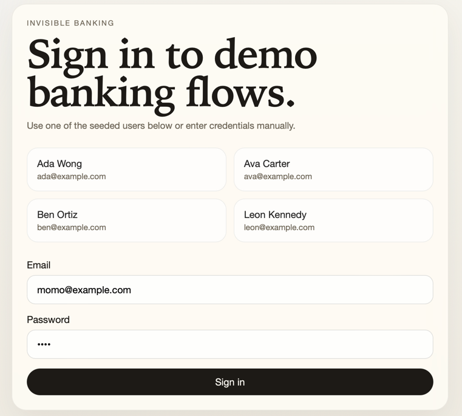

# Invisible Banking Service

Spring Boot + SQLite banking service with a React UI. The recommended way to run the application is with Docker Compose.

## Install

### Prerequisites

- Docker
- Docker Compose

### Build and run

From the repository root:

```bash
docker compose up --build
```

The application will be available at:

```text
http://localhost:8080
```

### Stop the application

```bash
docker compose down
```

### Reset local Docker data

This removes the persisted SQLite volume and starts with a fresh database the next time the app is started.

```bash
docker compose down -v
```

### Notes

- The Docker build runs the backend test suite before producing the final application image.
- The runtime container exposes a health check at `/health`.
- SQLite data is persisted in a Docker volume mounted at `/data/bank.db`.

## Using UI



Open `http://localhost:8080` after the container is running.

The UI supports:

- signing in with demo users shown on the login screen
- creating accounts
- creating cards for eligible accounts
- freezing and reactivating cards
- deposits, withdrawals, and transfers
- statement filtering by date range
- account deletion

Important behavior:

- `CHECKING` accounts can only receive `DEBIT` cards
- `CREDIT` accounts can only receive `CREDIT` cards
- frozen-card accounts reject transactions
- deleting an account also deletes its cards and transactions

Seeded demo credentials:

- `ada@example.com` / `demo123`
- `ava@example.com` / `demo123`
- `ben@example.com` / `demo123`
- `leon@example.com` / `demo123`

## CURLing

The examples below assume the service is running on `http://localhost:8080`.

### Health check

```bash
curl http://localhost:8080/health
```

### Sign up

```bash
curl -X POST http://localhost:8080/auth/signup \
  -H "Content-Type: application/json" \
  -d '{
    "fullName": "Taylor Fox",
    "email": "taylor@example.com",
    "password": "demo123"
  }'
```

### Log in

```bash
curl -X POST http://localhost:8080/auth/login \
  -H "Content-Type: application/json" \
  -d '{
    "email": "taylor@example.com",
    "password": "demo123"
  }'
```

### Create an account

Replace `HOLDER_ID` with the `holderId` returned by signup or login.

```bash
curl -X POST http://localhost:8080/accounts \
  -H "Content-Type: application/json" \
  -d '{
    "holderId": HOLDER_ID,
    "accountType": "CHECKING",
    "balance": 100.00
  }'
```

### List accounts for an account holder

```bash
curl http://localhost:8080/holders/HOLDER_ID/accounts
```

### Get a single account

```bash
curl http://localhost:8080/accounts/ACCOUNT_ID
```

### Create a debit card for a checking account

```bash
curl -X POST http://localhost:8080/accounts/ACCOUNT_ID/cards \
  -H "Content-Type: application/json" \
  -d '{
    "type": "DEBIT",
    "status": "ACTIVE"
  }'
```

### Freeze a card

```bash
curl -X PATCH http://localhost:8080/accounts/ACCOUNT_ID/cards/status \
  -H "Content-Type: application/json" \
  -d '{
    "status": "FROZEN"
  }'
```

### Deposit money

```bash
curl -X POST http://localhost:8080/transactions \
  -H "Content-Type: application/json" \
  -d '{
    "recipientAccountId": ACCOUNT_ID,
    "amount": 25.00,
    "transactionType": "DEPOSIT",
    "note": "Initial funding"
  }'
```

### Withdraw money

```bash
curl -X POST http://localhost:8080/transactions \
  -H "Content-Type: application/json" \
  -d '{
    "senderAccountId": ACCOUNT_ID,
    "amount": 10.00,
    "transactionType": "WITHDRAWAL",
    "note": "ATM withdrawal"
  }'
```

### Transfer money

```bash
curl -X POST http://localhost:8080/transactions \
  -H "Content-Type: application/json" \
  -d '{
    "senderAccountId": SOURCE_ACCOUNT_ID,
    "recipientAccountId": TARGET_ACCOUNT_ID,
    "amount": 15.00,
    "transactionType": "TRANSFER",
    "note": "Savings transfer"
  }'
```

### Get a statement

```bash
curl http://localhost:8080/accounts/ACCOUNT_ID/statement
```

### Get a filtered statement

```bash
curl "http://localhost:8080/accounts/ACCOUNT_ID/statement?fromDate=2026-03-01&toDate=2026-03-31"
```

### Delete an account

```bash
curl -X DELETE http://localhost:8080/accounts/ACCOUNT_ID
```
